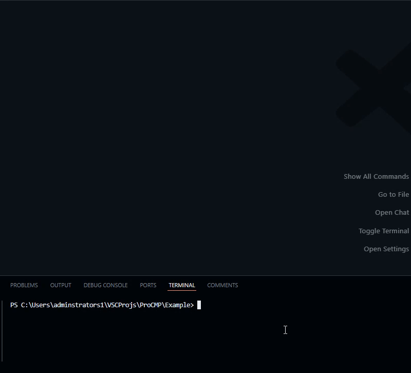
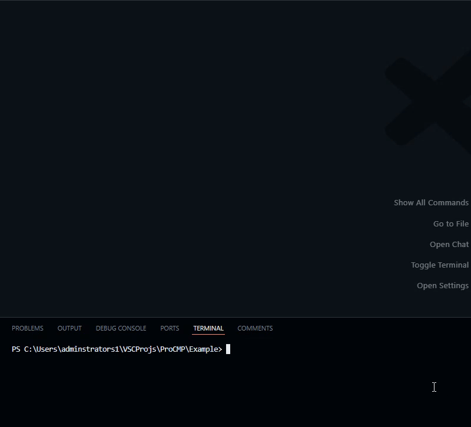

# ProCMP

A build composer system using Lune & darklua with automated release deployment.

## About

ProCMP allows for easy build composition with composer-markers, it gives you access to runtime build data and add extra information such as headers to your distribution file.

| Release build | Debug build |
|-|-|
|  |  |

## Dependencies

To use ProCMP, you must have Lune and Darklua installed. See the guides below for more information.

> It is most recommended to use [Aftman](https://github.com/LPGhatguy/aftman) to manage these dependencies.

- [Lune installation](<https://lune-org.github.io/docs/getting-started/1-installation>)
- [Darklua installation](<https://github.com/seaofvoices/darklua>)

## Usage

1. **Download the ProCMP script**. You can place it wherever, so long as you reference it correctly in the `lune run` command. *(below)*

2. **Add a frame**, this is essentially your build insertion file. Add composer markers to get build info like as the build itself, and the build version.
  [Example frame](Example/build/frame.luau)

> If you use [luau-lsp](https://github.com/JohnnyMorganz/luau-lsp) and don't like the warnings given when using composer markers, or your own set macros for accessing build info in runtime, then you can use type definitions to silence them.
  [Example type definitions](Example/.globals/pcmp.d.luau)

3. **Run using `lune run <procmp_location> <config_location>`**, you should be prompted with a CLI interface asking for the build configuration and version. After completing the prompt your file will be built and composed at the output location.
  [Example PCMP config](Example/build/.pcmp.json)

> You can also use *VS code tasks* to build using a keybind instead of typing a terminal command
  [Example VSC task config](Example/.vscode/tasks.json)
  [Learn more](https://code.visualstudio.com/docs/debugtest/tasks)
