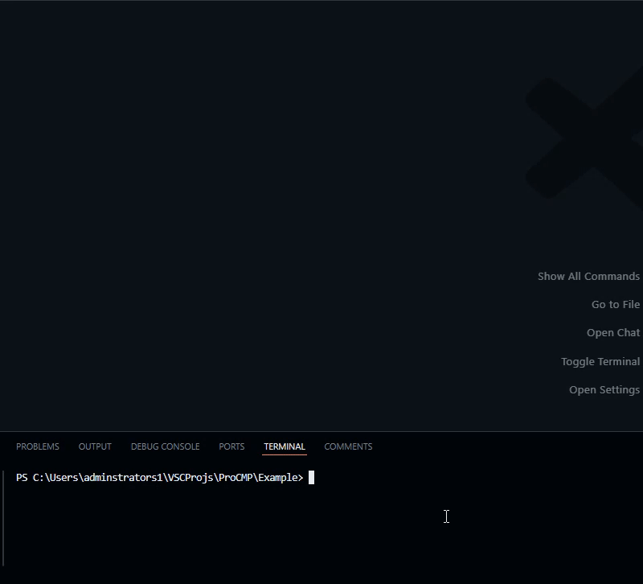
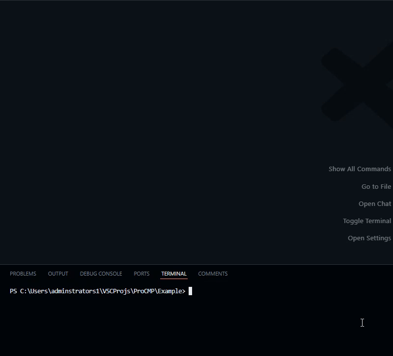

# ProCMP

A DarkLua-based build composition system with automated release deployment and support for runtime build macros.

## About

ProCMP allows for easy build composition with composer-markers, it gives you access to runtime build data and add extra information such as headers to your distribution file.

| Release build | Debug build |
|-|-|
|  |  |

> Pre-V2 images

## Installation

### [Aftman](http://github.com/LPGhatguy/aftman)

> [!NOTE]  
> This is currently the only officially supported installation method.

```powershell
aftman add seaofvoices/darklua # Darklua is required to use ProCMP
aftman add Proton-Utilities/ProCMP
```

> By default the terminal command is `ProCMP`, you can change this in your `aftman.toml` location.

## Usage

1. **Add a frame**, this is essentially your build insertion file. Add composer markers to get build info like as the build itself, and the build version.
</br> [Example frame](example/build/frame.luau)

> If you use [luau-lsp](https://github.com/JohnnyMorganz/luau-lsp) and don't like the warnings given when using composer markers, or your own set macros for accessing build info in runtime, then you can use type definitions to silence them.
</br> [Example type definitions](example/.globals/pcmp.d.luau)

2. **Run using `ProCMP build <config_location>`**, you should be prompted with a CLI interface asking for the build configuration and version. After completing the prompt your file will be built and composed at the output location.
</br> [Example PCMP config](example/build/.pcmp.json)

> You can also use *VS code tasks* to build using a keybind instead of typing a terminal command
</br> [Example VSC task config](example/.vscode/tasks.json)
</br> [Learn more](https://code.visualstudio.com/docs/debugtest/tasks)
